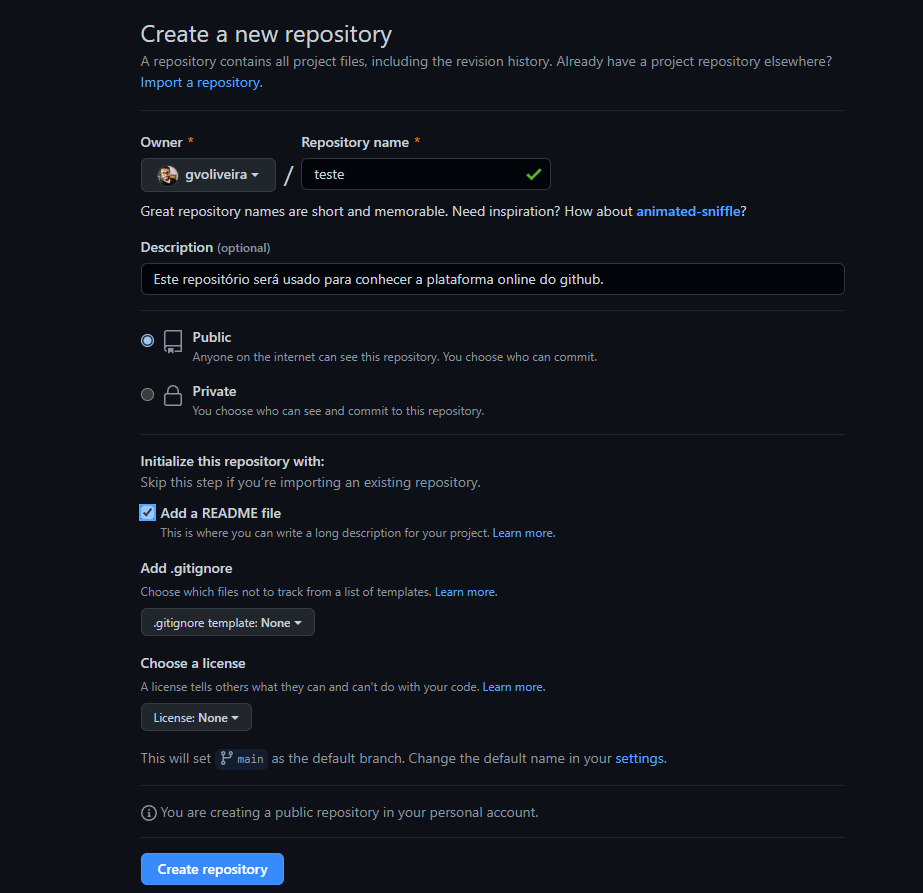
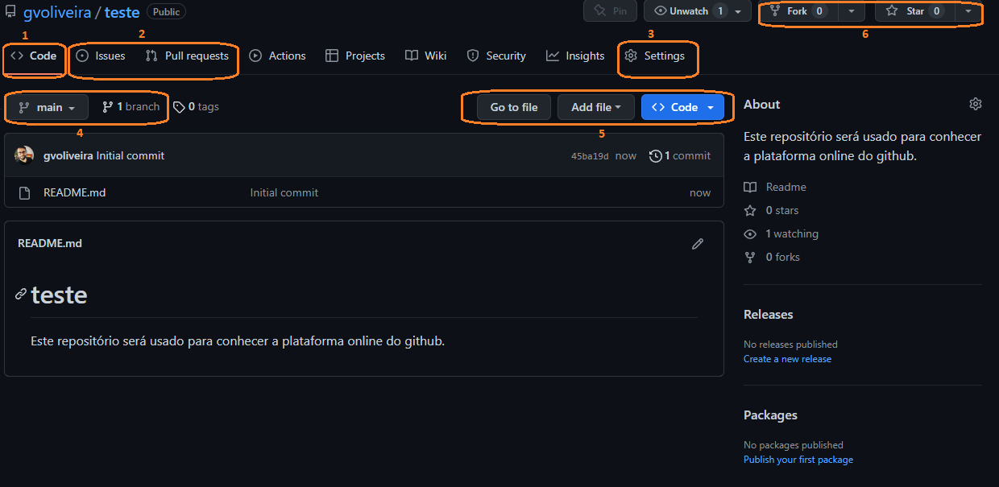

# Introdução a GitHub :robot:

Olá jovem! Tudo bem com você?!
:thumbsup:

Bem vindo a este pequeno repositório, que tem o objetivo de mostrar um pouco do funcionamento do github, especificamente do github web, utilizando funções básicas pelo navegador. Mas se caiu de paraquedas por aqui, o que será esse tal de GitHub? 

# O que é o GitHub?
O GitHub é um serviço baseado em nuvem que hospeda um sistema de controle de versão (VCS) chamado Git. Ele permite que os desenvolvedores colaborem e façam mudanças em projetos compartilhados enquanto mantêm um registro detalhado do seu progresso.

# Onde vou usar o GitHub nesta disciplina?
Alguns projetos da disciplina serão mantidos por aqui e seu link deverá ser enviado ao professor, como entrega da atividade/projeto. Logo, é importante aprender como criar um repositório, adicionar contribuidores a um projeto e atualizá-lo para fazer a entrega final.

# Criando um repositório diretamente pelo GitHub no navegador.
- Depois de você ter criado a sua conta na plataforma, você irá em "Criar novo repositório" `New Repository`.
- Você vai preencher com as informações do projeto, então dar o nome do repositório, colocar uma breve descrição e criar.

A Figura mostra a tela inicial de criação do repositório. Note que o endereço online do seu repositório será o nome do seu usuário, seguido do nome do repositório, separados por `/`. Nesse caso: `github.com/gvoliveira/teste` 
Neste exemplo, o repositório foi criado como "Public", ou seja, qualquer um pode ter visibilidade do repositório. Também foi selecionada a opção `add a README file`, que serve para criar um arquivo de descrição do seu repositório. No geral, servirá para descrever com mais detalhes o seu projeto.

As opções de `.gitignore` e `Choose a license` serão deixados de lado nesse momento, mas não se esqueça deles, em breve serão úteis!

# Criei o repositório, e agora?
Com o repositório criado, você já poderá trabalhar com seus arquivos do projeto. Se está sendo meu aluno, provavelmente está codificando em computadores dos laboratórios. Caso o computador esteja sendo restaurado a cada reinicialização, seus projetos terão um tempo de vida curto na máquina. Dessa forma, vamos manter eles seguros neste repositório! Mas para que isso seja possível, é necessário entendermos o funcionamento da ferramenta, então aqui vão alguns pontos a se observar.

1 - Code - Nessa aba você acessa os arquivos e códigos do projeto, você pode selecionar a `branch` que deseja visualizar.

2 - Issues e Pull requests -  As issues do GitHub para que um usuário possa deixar um feedback e/ou auxiliar na construção de algum projeto desenvolvido por outras pessoas. Já o Pull request(PR) é um tipo de solicitação na qual um usuário informa a outras pessoas sobre as alterações por push feitas em uma ramificação de um repositório no GitHub. . Após a abertura de uma solicitação de pull, você poderá discutir e revisar as possíveis alterações com colaboradores e adicionar confirmações de acompanhamento antes que as alterações sejam mescladas na ramificação base.

Sei que tantas definições podem parecer confusas, mas com a prática, já já elas se tornarão parte do seu dia a dia. Bora continuar...

3 - Settings - Aqui o usuário poderá alterar configurações do projeto das mais diversas formas. Também poderá adicionar contribuidores ao mesmo! Essa funcionalidade será utilizada nos nossos projetos, pois documentará todas as mudanças feitas por cada um dos membros no trabalho.

4 - Branch - A branch é uma ramificação (citada acima). Ela serve para isolar o trabalho de desenvolvimento sem afetar outros branches no repositório. Cada repositório tem um branch padrão e pode ter vários outros branches. Isso quer dizer, que em um projeto colaborativo por exemplo, vocês podem manter uma branch `main`, onde tudo está funcionando, e outras branchs para cada um da equipe desenvolver e testar funcionalidades. Dessa forma, ninguém fará com que a branch `main` seja "estragada". Em outras palavras, terão um trabalho em equipe sem brigas. Nessa opção podemos alternar entre as brancs do nosso projeto e acompanhar os arquivos atualizados de cada uma delas.

5 - Aqui temos algumas opções para: a) navegar até um arquivo; b) adicionar arquivos ao projeto (podem ser criados arquivos novos ou podem ser feitos uploads da sua máquina local para a nuvem); c) opções para clonar um projeto e trazê-lo da nuvem para sua máquina local. É importante lembrar que a clonagem de um repositório baixa uma cópia completa de todos os dados dele que o GitHub.com tem no momento, incluindo todas as versões de cada arquivo e pasta do projeto. Então cuidado para não baixar uma versão desatualizada. :man_shrugging:

6 - Aqui temos as estrelas, elas facilitam a localização posterior de um repositório ou tópico. Você pode ver todos os repositórios e tópicos marcados com estrelas acessando sua página de estrelas. Você pode adicionar repositórios e tópicos aos favoritos para descobrir projetos semelhantes no GitHub.

Já o `Fork` é um novo repositório que compartilha configurações de código e visibilidade com o repositório "upstream" original. Os forks geralmente são usados para iterar ideias ou alterações antes de serem propostas de volta para o repositório upstream, como em projetos código aberto ou quando um usuário não tem acesso de gravação ao repositório upstream. Se isso pareceu confuso, vamos a um exemplo: você viu um projeto de código aberto, gostou dele, baixou para a sua máquina e fez algumas melhorias. Você poderá contribuir com o projeto principal, sugerindo essas mudanças para que sejam incorporadas.

Bem, chegamos ao fim de uma curta caminhada, mas que será importante para seu desenvolvimento profissional! Entender esses conceitos desde o começo do curso fará com que tenha mais autonomia e também mais controle sobre os códigos que fará no futuro. 

Agora vamos praticar um pouco?! Bora assistir a aula concentrado ein! :grin:

